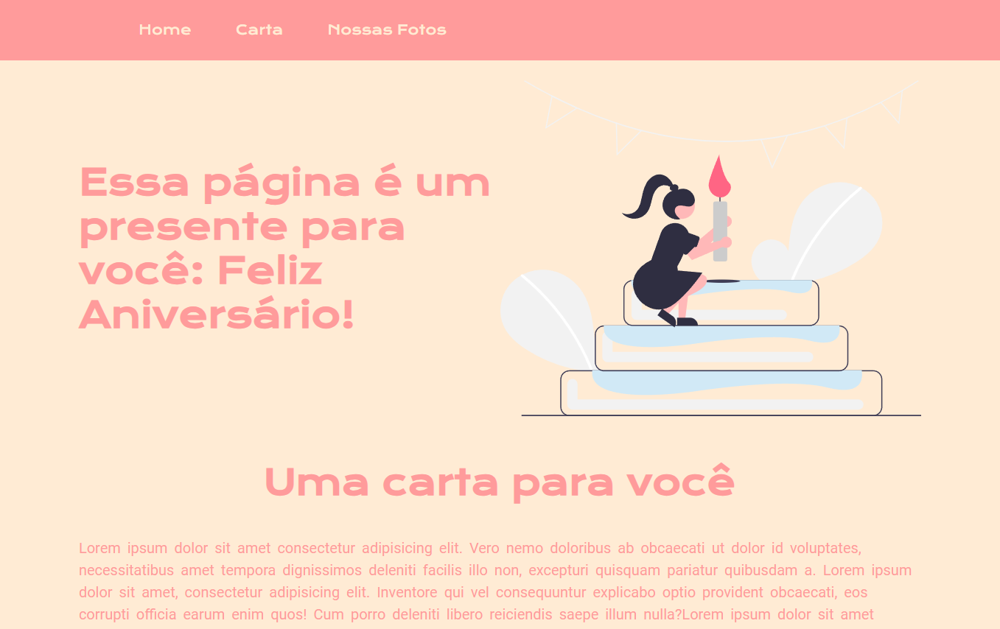

# Landing Page de Feliz Aniversário 🎉

Este projeto é uma Landing Page de Feliz Aniversário, desenvolvida inteiramente com HTML e CSS. O objetivo principal foi aprimorar minhas habilidades em design de páginas, estruturação semântica do HTML e estilização avançada com CSS.

## O que explorei neste projeto:
- Melhoria no design responsivo para proporcionar uma boa experiência em diferentes dispositivos.
- Organização e estruturação clara do HTML, focando em boas práticas e semântica.
- Uso criativo de CSS para estilizar elementos e criar uma aparência visual atrativa e harmoniosa.
- Este projeto me permitiu aprofundar meus conhecimentos sobre o desenvolvimento de páginas web simples, porém visualmente agradáveis.

